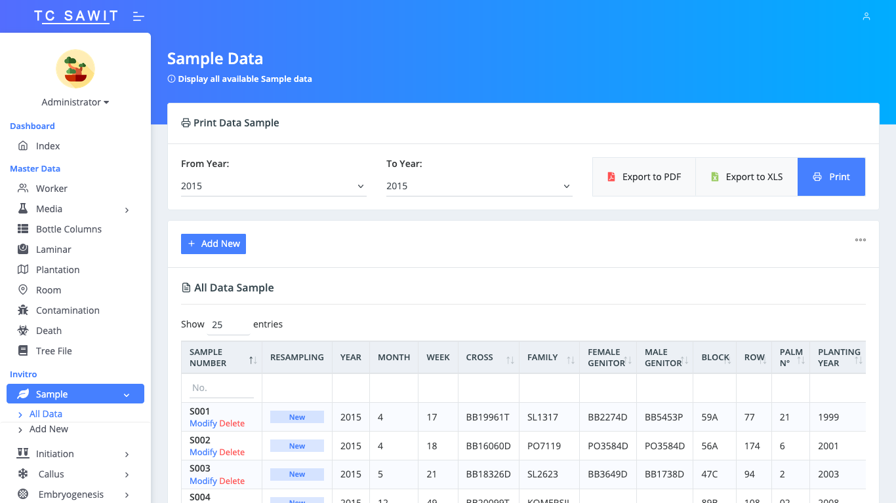
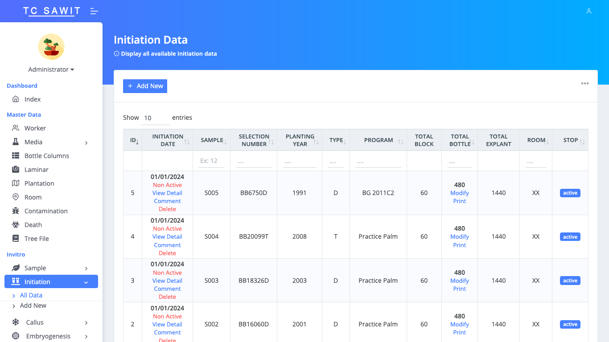
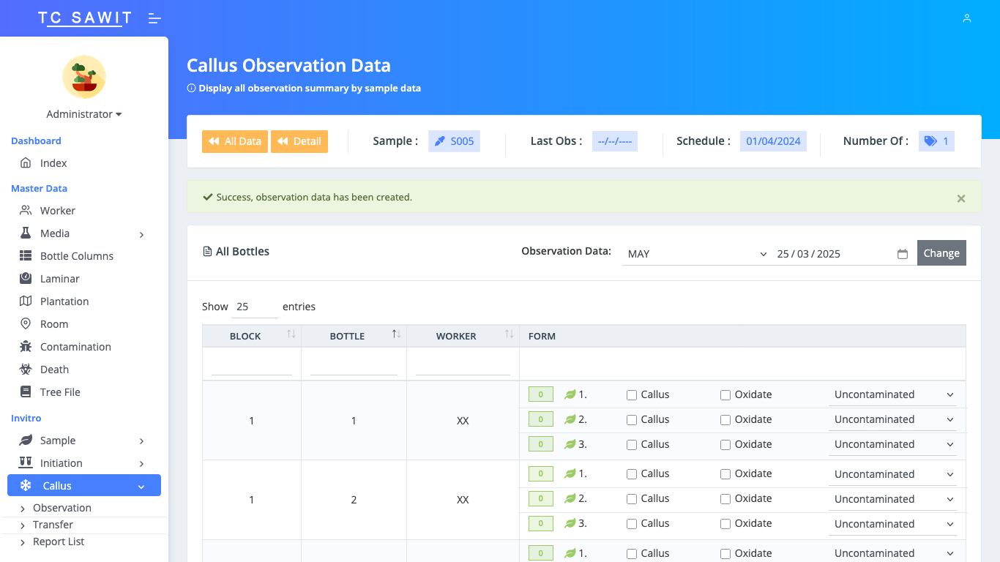

# TC Sawit - Palm Tissue Culture Management System

**TC Sawit** is a comprehensive management system developed to handle the full workflow of palm tissue culture production. This application is made for one of the leading palm oil companies in Sumatra.  The system provides a detailed and structured interface that supports both **invitro** and **exvitro** processes, covering everything from sample initiation to field planting.

The platform is built to ensure traceability, accuracy, and efficient monitoring of each tissue culture stage, facilitating real-time management for administrators and lab operators.

## 🧬 Functional Modules

### 📁 Master Data
- Worker Management
- Media and Bottle Configuration
- Laminar Setup
- Plantation & Room Assignments
- Contamination and Death Records
- Tree File Documentation

### 🧪 Invitro Process
- Sample Registration & Tracking
- Initiation Phase
- Callus Development
- Embryogenesis Stages
- Liquid Culture Monitoring
- Maturation Process
- Germination Tracking
- Rooting Phase

### 🌱 Exvitro Process
- Acclimatization
- Hardening
- Nursery Progress
- Field Deployment

Each module is interconnected to ensure seamless data flow and stage-by-stage control over the palm tissue culture pipeline.

## 🖼️ Screenshots

### Sample Data


### Initiation Data


### Calluscallogenesis Observation Form


## 🛠️ Tech Stack

- **Backend:** Laravel 8  
- **Frontend:** jQuery  
- **Database:** SQL Server

## ⚙️ Installation & Setup

1. Clone the repository:
   ```bash
   git clone https://github.com/aldhi88/tissue-culture-sawit.git
   cd tc-sawit
   ```

2. Install dependencies:
   ```bash
   composer install
   npm install && npm run dev
   ```

3. Copy `.env.example` to `.env` and set up your SQL Server configuration.

4. Run system initialization:
   ```bash
   php artisan app:init
   ```

5. Start the application:
   ```bash
   php artisan serve
   ```

## 📌 Notes

This system was built to manage a highly specialized and complex workflow in the tissue culture domain. Its modular approach allows for scalability and precise tracking of thousands of samples across different growth environments.

---
